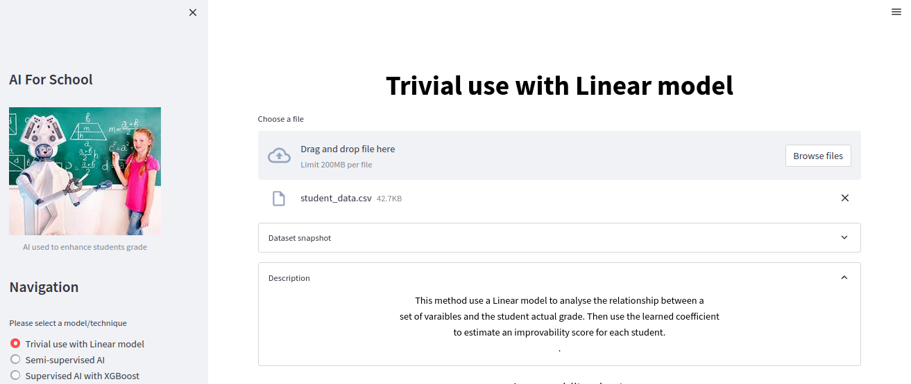
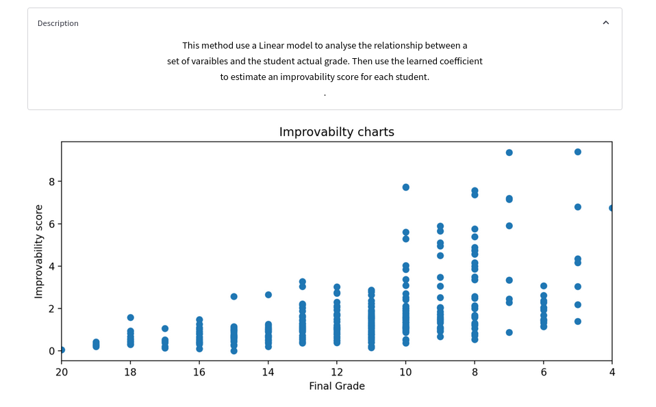

# AI For School

## Brief Description

Faced with the fall in the educational level observed following the closure of schools, can you, with the use of data and AI, propose a solution to try to remedy the situation.   

## Approaches

### Approache 1: Linear model
This method use a Linear model to analyse the relationship between a set of varaibles and the student actual grade. Then use the learned coefficient to estimate an improvability score for each student.

### Approache 2: Semi-supervised method
This method use a semi-supervied method to group student with similar background. And then, within each cluster,  we estime the improvability score by comparing each student with the top students within the same group.

### Approache 3: Supervised method
This approach is pretty straighforward. First, we use a boosting (tree) model to estimate the student's grade. Then we compute the difference between the actual grade and the predicted grade. And Finally, we use that difference delta to estimate the improvability score. Simple put, if the predicted grade is greater than than the actual grade, then the student has great chance of improvability.


## How to install

* git clone the project :)

```
If on AWS EC2, do the following steps
```

* Run `chmod +x ec2.sh` (if on ec2 server)
* Run `./ec2.sh` (if on ec2 server)

```
For the next part, make sure to have docker installed.
(By running "docker -v", you should see something like this "Docker version 20.10.21, build baeda1f")
```

* Run `make init`
* Run `make install` (this step shouldn't be necessary but run it just to be sure)

## Run the app

After the installation part, the app should already be running. But if not, just run `make start`.
Now, to see the app running, go to one of the following url:
- `localhost`
- `localhost:8501`

### Snapshot of the app

<div align="center">
    
</div>
<div align="center">
    
</div>
